# AI Trust Cell — Organizational Structure

**21 people · 1 embedded specialist · Three teams + Cell Lead**

---

## Org Chart

```mermaid
graph TD
    classDef cl fill:#1B3A5C,stroke:#1B3A5C,color:#fff,font-weight:bold
    classDef rr fill:#6D4FB5,stroke:#6D4FB5,color:#fff
    classDef pt fill:#2E5FAD,stroke:#2E5FAD,color:#fff
    classDef il fill:#157A6B,stroke:#157A6B,color:#fff
    classDef ext fill:#F4F6FA,stroke:#94A3B8,color:#4A5568
    classDef emb fill:#EEF3FF,stroke:#2E5FAD,color:#2E5FAD

    CL["Cell Lead\nPrincipal AI Trust Architect\n────────────────\n21 people · 1 embedded"]:::cl

    RRTL["Research + Red Team Lead\nPrincipal Researcher"]:::rr
    HF1["HF Researcher\nFoundational behavioral science"]:::rr
    HF2["HF Researcher\nApplied intervention design"]:::rr
    RA["Research Analyst\nDomain expert · operational validity"]:::rr
    CQS["Corpus Quality Specialist\nFGTS review queue · cold start"]:::rr
    RTE1["Red Team Evaluator\nModel · prompt · agent"]:::rr
    RTE2["Red Team Evaluator\nPlatform adversarial"]:::rr

    EL["Engineering Lead\nStaff / Principal Engineer"]:::pt
    PE1["Platform Engineer\nPCES · PGS"]:::pt
    PE2["Platform Engineer\nProvenance · MOIRAI"]:::pt
    PE3["Platform Engineer\nDPS · CODEX"]:::pt
    BE1["Backend Engineer\nSession · Telemetry"]:::pt
    BE2["Data Engineer\nIntegrations — CVS · MDS · KCS"]:::pt
    IIE["Interface + Integration Engineer\nATHENA"]:::pt
    PKI["Security · PKI Specialist\nEmbedded — cryptographic attestation"]:::emb

    MLL["Intelligence ML Lead\nStaff ML Engineer"]:::il
    CE1["Calibration Engineer\nTCS · MIMIR pipeline"]:::il
    CE2["ML Engineer\nFGTS · RQS · ERAS"]:::il
    MFE1["Media Forensics Engineer\nVideo · Audio — MAS · EIDOLON"]:::il
    MFE2["Media Forensics Engineer\nImage · OCR — MAS · EIDOLON"]:::il
    CNE["Classifier + NLP Engineer\nIAS · Classifiers · Semantic similarity"]:::il

    EAB["Ethics Advisory Board\nExternal · Quarterly"]:::ext
    MV["Model Vendors\nFormal technical partnerships"]:::ext
    NG["Norse Groups\nShared services · Inference · MIMIR"]:::ext
    AP["Academic Partners\nHCI research · Peer review"]:::ext
    OU["Operational Units\nAnalysts · Research participants"]:::ext
    ST["Security Team\nPKI infrastructure owner"]:::ext

    CL --> RRTL
    CL --> EL
    CL --> MLL

    RRTL --> HF1
    RRTL --> HF2
    RRTL --> RA
    RRTL --> CQS
    RRTL --> RTE1
    RRTL --> RTE2

    EL --> PE1
    EL --> PE2
    EL --> PE3
    EL --> BE1
    EL --> BE2
    EL --> IIE
    EL -."embedded".-> PKI

    MLL --> CE1
    MLL --> CE2
    MLL --> MFE1
    MLL --> MFE2
    MLL --> CNE

    EAB -."quarterly review".-> CL
    MV -."technical partnership".-> CL
    NG -."shared services".-> EL
    AP -."research partnership".-> RRTL
    OU -."research participants".-> RA
    ST -."PKI infrastructure".-> PKI
```



---

## Team Composition

### Cell Lead — 1 person

| Role | Level | Scope |
|---|---|---|
| Principal AI Trust Architect | Distinguished / Fellow | Owns the triple mandate across all three teams. Manages three direct reports. External relationships: Ethics Advisory Board, model vendors, Norse Groups. Reports to CTO on the governance line. |

The Cell Lead sits above all three teams and does not embed in any. The job at this org scale is coordination and mandate protection — ensuring the delivery track on Platform and Intelligence does not raid Research capacity, ensuring the three teams build toward the same architecture, and ensuring red team findings drive changes rather than sitting in reports.

---

### Research and Red Team — 7 people

| Role | Count | Primary Responsibility |
|---|---|---|
| Research + Red Team Lead | 1 | Research agenda, research cycle governance, pre-registration process, academic partnership program. |
| HF Researcher — Foundational | 1 | Theoretical backbone: vigilance decrement, automation bias, calibration science. Grounds intervention design in behavioral research. |
| HF Researcher — Applied | 1 | Applied intervention design and experimental protocol development. Tests ATHENA interventions in operational conditions. |
| Research Analyst | 1 | Domain expert bridge. Runs ATHENA evaluation sessions with operational analysts. Evaluates whether interventions produce genuine epistemic improvement in realistic legal analysis conditions versus controlled settings. |
| Corpus Quality Specialist | 1 | **New role.** Owns the FGTS human review queue: reviews flagged corrections, accepts or rejects, escalates to senior attorneys. Owns the cold start calibration task set — 30-50 verification tasks per domain for analyst onboarding calibration. Profile: senior paralegal or junior attorney with AI familiarity, not an engineer. |
| Red Team Evaluator — Model / Prompt / Agent | 1 | Original red team function: adversarial prompting, jailbreak testing, systematic bias detection, behavioral edge cases. Security or intelligence analysis background. |
| Red Team Evaluator — Platform Adversarial | 1 | IAS/SCUDO injection taxonomy development and adversarial testing. MAS/EIDOLON classifier red-teaming across four modalities. CVS citation adversarial pattern development. Cryptographic chain integrity verification. Needs ML and platform depth. |

**Research track:** 8-12 week pre-registered research cycles. Null results are valid outputs. Reports reviewed by Ethics Advisory Board before reaching leadership. Capacity protection: research and evaluation tracks are protected at minimum 60% of team capacity. Delivery gets the remainder.

**Evaluation track:** Continuous. Monthly report goes directly to Cell Lead and CTO governance line. Not filtered through engineering teams.

---

### THEMIS Platform Team — 7 people + 1 embedded specialist

| Role | Count | Primary Ownership |
|---|---|---|
| Engineering Lead | 1 | THEMIS platform architecture, data model and service boundary decisions, API contracts. Leadership pair with Cell Lead. Peer to Intelligence ML Lead. |
| Platform Engineer — PCES / PGS | 1 | Safety gates. Privilege classification schema, matter scope enforcement, policy rule engine, interaction class definitions, PGS policy authoring UI. Legal data governance background helpful. |
| Platform Engineer — Provenance / MOIRAI | 1 | Provenance graph. Neo4j, DAG walking, cryptographic attestation integration, multi-analyst attribution schema, matter-level cross-session query index. Not a generalist backend role. |
| Platform Engineer — DPS / CODEX | 1 | Document provenance service. Kafka write buffer, Redis cache, authoring solution API contract, MOIRAI flush logic. Primary contact for the custom authoring solution integration. |
| Backend Engineer — Session / Telemetry | 1 | Session Context Store, Behavioral Telemetry Pipeline, Verification Store, Annotation Store. High-throughput write systems, event ordering guarantees for RAI Engine input streams. |
| Data Engineer — Integrations | 1 | CVS/VERITAS Westlaw and Lexis API integration, MDS/KRONOS vendor API polling, KCS/ARGUS external feed integration. Data engineering and integrations. |
| Interface + Integration Engineer | 1 | ATHENA front-end and integration layer between ATHENA and all THEMIS services. Present in research track discussions — not a ticket-recipient role. |
| Security / PKI Specialist | 1 (embedded) | Vault key management, per-service key pair provisioning, TSA integration, signing infrastructure. Critical during Phase 3-4 for cryptographic attestation build (~6 months intensive). Lower intensity thereafter for key rotation and chain audit maintenance. Embedded from the firm's security team rather than a permanent trust cell hire. |

**Delivery track:** 2-week sprints. Standard engineering program governance. Bounded to available capacity after research and evaluation tracks are protected.

---

### THEMIS Intelligence Layer Team — 6 people

| Role | Count | Primary Ownership |
|---|---|---|
| Intelligence ML Lead | 1 | ML architecture across all intelligence services. Calibration science depth plus ML systems experience. Third peer in the Cell Lead leadership structure alongside Engineering Lead. |
| Calibration Engineer | 1 | TCS/MIMIR calibration pipeline: Bayesian prior initialization, domain-specific RAI computation, correction confidence weighting function, cold start protocol implementation, calibration state machine. Calibration science role as much as engineering. |
| ML Engineer — FGTS / RQS / ERAS | 1 | FGTS quality systems, RQS retrieval quality models, ERAS reasoning capture and claim indexing. Quality and observability ML layer. NLP and information retrieval background. |
| Media Forensics Engineer — Video / Audio | 1 | MAS/EIDOLON video and audio modalities: temporal artifact analysis, facial consistency scoring, voice synthesis detection, speaker verification, spectral anomaly detection. |
| Media Forensics Engineer — Image / OCR | 1 | MAS/EIDOLON image and scanned document modalities: GAN artifact detection, EXIF forensics, image manipulation analysis, per-region OCR confidence scoring. |
| Classifier + NLP Engineer | 1 | IAS/SCUDO ML classifier development (model side). Claim Extractor, Agreement Classifier, Query Classifier, Semantic Similarity Service. Embedding systems. |

---

## Headcount Summary

| Team | Permanent | Embedded |
|---|---|---|
| Cell Lead | 1 | — |
| Research and Red Team | 7 | — |
| THEMIS Platform Team | 7 | 1 (Security / PKI Specialist) |
| THEMIS Intelligence Layer Team | 6 | — |
| **Total** | **21** | **1** |

The original estimate was 11-13. The delta is driven by three factors: the expanded platform scope (13 services and 3 architectural extensions vs. the original 9), the expanded red team scope (four distinct adversarial evaluation programs that one person cannot run), and the Corpus Quality Specialist role that did not exist in the original design.

The team with the least slack is the Intelligence Layer. Six people covering MAS/EIDOLON across four modalities, the full calibration pipeline, FGTS quality systems, RQS, ERAS, and all classifier infrastructure has no buffer if MAS/EIDOLON proves harder than expected.

---

## External and Partner Relationships

| Partner | Relationship type | Primary contact |
|---|---|---|
| Ethics Advisory Board | External authority · Quarterly review · Data practices and methodology oversight | Cell Lead |
| Model Vendors | Formal technical partnerships · Early eval access · Safety team escalation path | Cell Lead |
| Norse Groups | Shared services · Inference gateway · MIMIR retrieval infrastructure | Engineering Lead |
| Academic Partners | HCI research · Peer review · Joint research protocols · Data sharing agreements | Research + Red Team Lead |
| Operational Units | Research participants · Formal ethics protocol · Informed consent | Research Analyst |
| Security Team | PKI infrastructure owner · Vault management · Key pair provisioning | Security / PKI Specialist (embedded) |

---

## Leadership Structure

Three team leads report directly to the Cell Lead. They operate as a peer leadership trio on cross-team decisions.

```
Cell Lead
├── Research + Red Team Lead    [Research · Governance · Adversarial eval]
├── Engineering Lead            [Platform · ATHENA · Data integrations]
└── Intelligence ML Lead        [Calibration · Media forensics · Classifiers]
```

**Engineering Lead and Intelligence ML Lead** are a technical peer pair on architecture decisions that span the platform and intelligence layers — specifically the TCS/MIMIR service boundary (Platform owns the service; Intelligence owns the calibration models it runs) and the MAS/EIDOLON ingestion pipeline position (Platform owns the pipeline; Intelligence owns the classifiers).

**Research + Red Team Lead and Engineering Lead** are a peer pair on ATHENA — Research designs the interventions; Platform builds them. The Interface + Integration Engineer is the integration point, present in research track discussions.

**Research + Red Team Lead and Intelligence ML Lead** are a peer pair on calibration methodology — HF Researchers design the calibration science; Intelligence ML engineers implement it. The Corpus Quality Specialist is the operational interface between the two teams at the FGTS review queue.

---

*AI Trust Cell · Organizational Design · Three-team structure · Version 2.0*
